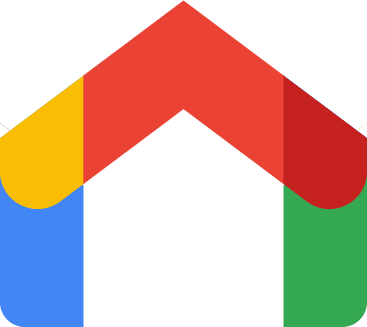
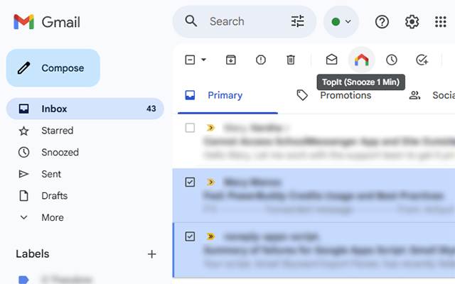

  
  <h1>TopIt for Gmail: Send Emails to Top</h1>
  
  
  

**TopIt** is a lightweight Chrome Extension that adds a **"Send to Top"** button directly to the Gmail toolbar. It works by snoozing emails for just 1 minute so they reappear at the top of your inbox almost instantly.

  

## Why TopIt?

Gmail doesn't have a native way to **reorder your inbox** or manually "bump" an important email to the top. While the native Snooze feature exists, using it to reorder requires multiple clicks and manual time entry. 

**TopIt** solves this by turning the Snooze mechanism into a **1-click "Push to Top" feature**, essentially letting you reorder your priorities instantly.

## Features

- 🚀 **Send to Top**: Adds a **TopIt** button next to the native "Snooze" button in both the inbox view and inside open emails.
- ⚡ **Instant Action**: Automatically snoozes the email to the current time + 1 minute (rounded up).
- 🎨 **Native Look & Feel**: The custom button mimics Gmail's style and automatically syncs with Gmail's theme/density updates.
- 🛡️ **Privacy Focused**: No data collection, no tracking. Runs entirely locally in your browser.

## How it Works

The extension injects a script that:
1. Locates Gmail's native snooze button.
2. Injects a custom **TopIt** icon alongside it.
3. When clicked, it automates the sequence to:
    - Open the native Snooze menu.
    - Select "Pick date & time".
    - Input the current date and (Current Time + 1 Min).
    - Save the dialog.

It uses robust input simulation to ensure Gmail's internal validation accepts the programmatically entered time.

## Installation

### 🌐 Official Chrome Web Store
The easiest way to get TopIt is to install it directly from the [Chrome Web Store](https://chromewebstore.google.com/detail/eapkefpnemmndlilinojkfpdlglejagc).

### 🛠️ From Source (Developer Mode)

1. Clone or download this repository.
2. Open Chrome and navigate to `chrome://extensions/`.
3. Enable **Developer mode** in the top right corner.
4. Click **Load unpacked**.
5. Select the **`src`** folder inside this project.

## Privacy Policy

**TopIt for Gmail** is built with a "Privacy First" approach. 

- **No Data Collection:** The extension does not collect, store, or transmit any user data, personal information, or email content.
- **100% Local:** All operations are performed locally in your browser. No data ever leaves your device.
- **No Tracking:** There are no analytics, cookies, or third-party trackers.
- **Host Permission:** The `https://mail.google.com/*` permission is strictly used to inject the "Send to Top" button and automate the native snooze dialog.

For the full legal text, please see our [Privacy Policy](PRIVACY.md).

## Contributing

Contributions are welcome! Feel free to open issues or submit pull requests to improve the extension.

## 🛠️ Support

If you find a bug, have a feature request, or need help, please [open an issue](https://github.com/PhotoPaul/TopIt/issues) on GitHub.

## Disclaimer

This project is not affiliated with, endorsed by, or connected to Google LLC or Gmail. It is an independent open-source project.

## License

This project is licensed under the MIT License - see the [LICENSE](LICENSE) file for details.
